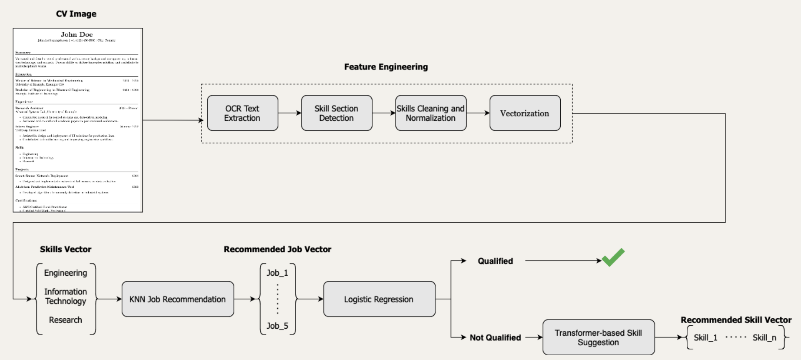

# AI-Powered Job & Skill Recommendation System (ReSkillAI)

<p align="center">
  
</p>

Personalized job recommendations and targeted upskilling guidance from a CV or a list of skills.  
The pipeline applies:
- **KNN** for job retrieval,
- **Logistic Regression** to estimate qualification likelihood,
- An optional **Transformer** to suggest the most impactful missing skills, and
- A light **OCR** module to extract skills from CV images.

---

## ✨ Features
- **Two recommendation modes**
  - *Exact/Close Match* (all jobs)  
  - *Require More Skills* (jobs that stretch the user with new skills)
- **OCR-based skills extraction** from CV images (no external services required)
- **Config-driven** (YAML) paths and defaults
- Clean **modular code** under `src/`
- Reproducible **synthetic users** (`user_job.csv`) for training/eval
- Optional **Transformer** to prioritize missing skills to learn next

---

## 📦 Repository Structure
```
ReSkillAI/
  configs/
    default.yaml
  data/
    raw/                 # place postings.csv, job_skills.csv, skill_mapping.csv here
    user_job.csv         # generated
  models/
    lr.pkl               # trained Logistic Regression (generated)
    skill_transformer.pt # trained Transformer weights (optional, generated)
  scripts/
    build_user.py
    train_lr.py
    train_skill_transformer.py
    recommend.py
  src/
    __init__.py
    utils.py             # all helpers centralized
    ocr.py               # OCR + parsing
    transformer.py       # Transformer module
  assets/
    framework.png        
  requirements.txt
  README.md
```

---

## 🗂️ Dataset

We use the **[LinkedIn Job Postings dataset](https://www.kaggle.com/datasets/davideev9/linkedin-job-postings)** from Kaggle.  
Place these **three** CSVs in `data/raw/`:

- `postings.csv`
- `job_skills.csv`
- `skill_mapping.csv`  *(mapped from the dataset’s `skills.csv`)*

> If your source files are named differently (e.g., `job_posting.csv` → `postings.csv`, `skill.csv` → `skill_mapping.csv`), just rename them before proceeding.

---

## ⚙️ Configuration

`configs/default.yaml` (example):
```yaml
paths:
  postings: data/raw/postings.csv
  job_skills: data/raw/job_skills.csv
  skill_mapping: data/raw/skill_mapping.csv
  lr_model: models/lr.pkl
  skill_transformer: models/skill_transformer.pt

recommend:
  top_jobs: 5
  require_more_skills: true
  # One of these can be provided as defaults:
  default_cv: assets/samples/CV.png
  # default_skills: ["Python", "SQL", "Docker"]
```

---

## 🚀 Setup

```bash
# 1) Create and activate a virtual environment (recommended)
python -m venv .venv
source .venv/bin/activate   # (Windows: .venv\Scripts\activate)

# 2) Install Python dependencies
pip install -r requirements.txt

# 3) Install the Tesseract OCR binary (macOS)
brew install tesseract
# (Linux: apt-get install tesseract-ocr; Windows: download installer from tesseract docs)
```

---

## ▶️ Usage

**1) Build synthetic users**
```bash
python scripts/build_user.py
```
Creates `data/user_job.csv`.

**2) Train Logistic Regression**
```bash
python scripts/train_lr.py
```
Saves `models/lr.pkl`.

**3) (Optional) Train Transformer**
```bash
python scripts/train_skill_transformer.py
```
Saves `models/skill_transformer.pt`.

**4) Run recommendations**
- From **CV** (uses YAML defaults if set):
```bash
python scripts/recommend.py
```
- With an explicit CV:
```bash
python scripts/recommend.py --cv assets/samples/CV.png
```
- With explicit skills (no OCR):
```bash
python scripts/recommend.py --skills Python SQL Docker
```
- Override top-N and mode:
```bash
python scripts/recommend.py --top_jobs 8 --require_more
```

---

## 🔧 Troubleshooting

- **`ModuleNotFoundError: src`**  
  Always run commands **from the project root**. Scripts call `setup_path()` to ensure `src/` is importable.

- **`No module named 'pytesseract'`**  
  Install Python deps: `pip install -r requirements.txt`  
  Also install the native binary:  
  - macOS: `brew install tesseract`  
  - Ubuntu: `sudo apt-get install tesseract-ocr`  
  - Windows: use official installer

- **Torch device warnings**  
  The Transformer suggester is optional. If you’re CPU-only, it still works.  
  For Apple Silicon acceleration, PyTorch will try **MPS** automatically.

---
